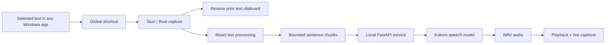

# SayIt

## Turning any selected text into private, one-shortcut speech

SayIt is a local Windows desktop reader designed to make listening to on-screen text feel like a native operating-system action. A user selects text in any application, presses a global shortcut, and hears it read aloud from a compact, always-on-top widget—without moving the text into a separate reader or sending it to a cloud service.

> **Project status:** Functional v0.1 desktop build  
> **Platform:** Windows  
> **Product shape:** Tauri desktop app with a React interface and local Kokoro text-to-speech  
> **Scope:** Product design, interaction design, frontend, desktop integration, and local speech service

---

## The opportunity

Text-to-speech can make long articles, documentation, messages, and drafts easier to consume. Yet the interaction often begins with avoidable work: copy the text, open another product, paste it, choose a voice, and start playback. That context switch makes a helpful accessibility and productivity tool feel separate from the work itself.

SayIt explores a simpler proposition:

**What if listening were an action users could invoke from anywhere, as quickly as copying?**

The product therefore needed to solve four connected problems:

- Capture a selection across Windows applications without requiring a browser extension or per-app integration.
- Provide enough playback context and control without becoming another full-size window.
- Keep private or sensitive selections on the device.
- Make long, malformed, or failed requests recoverable instead of leaving the product in an unclear state.

## Product principles

Four principles shaped the implementation:

1. **One gesture to start.** The default `Alt + S` shortcut works across applications.
2. **Present when useful, quiet when not.** SayIt lives in the system tray and surfaces a small widget only around the reading experience.
3. **Local by default.** Selected text is passed to a speech service bound only to the device's loopback address.
4. **Always show state.** Ready, loading, reading, saved, and error states each have explicit visual and accessible feedback.

## The core experience

The primary flow is intentionally short:

1. The user highlights text in any Windows application.
2. They press `Alt + S`, or a shortcut they have configured.
3. SayIt captures the selection and restores the previous text clipboard value.
4. The text is divided at sentence boundaries and sent in bounded chunks to the local speech engine.
5. The widget expands, begins playback, and promotes the current caption while previewing what comes next.
6. The user can change speed, open settings, stop playback, or let the widget return to its resting state.

This keeps the main task—listening—on the shortest path while moving voice, volume, appearance, and shortcut controls into a separate settings surface.

## Key design decisions

### 1. A micro-widget instead of a conventional app window

The resting widget is only 328 × 112 pixels and expands vertically during reading. It stays above other windows, near the bottom of the active display, so playback remains understandable without covering the source material.

The interface uses the Editorial Carbon design system: warm carbon surfaces, bone-white Instrument Sans typography, DM Mono for compact values, and a burnt-orange active state. Reduced transparency, crisp borders, and tighter radii give the utility a tailored feel, while the narrow action rail keeps speed, settings, and stop controls consistently reachable.

### 2. Captions that communicate progress

Audio alone does not make playback position obvious. SayIt pairs speech with a current line and a muted preview of the next line. As playback advances, the next line is promoted with a short vertical transition.

Captions are measured against the real Segoe UI font width rather than split by character count. Long words are handled explicitly, and motion can be reduced through the operating system's reduced-motion preference.

### 3. Progressive control, not up-front configuration

The default flow requires no setup. During playback, users can cycle through six reading speeds directly from the widget. Less frequent choices live in settings:

- 11 voice options grouped by voice type
- Output volume from 50% to 400%
- Custom global shortcut recording and validation
- A solid “readable surface” alternative to the glass appearance
- Voice preview before committing to a choice

Settings persist locally and synchronize between the main widget and the settings window.

### 4. Privacy as an architectural constraint

The speech service binds to a randomly selected `127.0.0.1` port and accepts requests only from known Tauri and development origins. Public API documentation is disabled, request fields are allow-listed, unsupported voices are rejected, and internal speech errors are not exposed to the interface.

The desktop content security policy blocks remote scripts and limits network connections to loopback addresses. This makes local processing part of the system design rather than a privacy promise layered onto a cloud workflow.

### 5. Explicit resilience for a multi-process product

SayIt coordinates a React interface, a Rust desktop shell, and a Python model process. The UI retries while the local service starts, supports cancellation with an abort controller, and prevents older playback requests from overwriting a newer run.

Selections up to 20,000 characters are accepted by the interface. They are split on sentence boundaries where possible, with every speech request capped at 4,000 characters. The widget provides a concise error cause and a retry action when synthesis or playback fails.

## How it works

| Layer | Responsibility |
| --- | --- |
| React + TypeScript | Widget states, settings, captions, chunking, audio playback, and recovery |
| Tauri + Rust | Global shortcut, selection capture, tray behavior, window management, and backend lifecycle |
| FastAPI + Python | Request validation, Kokoro model access, and WAV streaming |
| Local browser storage | Voice, volume, speed, shortcut, appearance, and onboarding state |

## Accessibility and usability details

The compact form factor did not remove basic accessibility affordances. The implementation includes:

- Clear labels and tooltips for icon-only actions
- Live regions for status and settings feedback
- Keyboard-visible focus treatments
- A reduced-motion mode
- A higher-opacity surface for difficult backgrounds
- Preserved pitch when playback speed changes
- Shortcut safeguards that reject common editing and operating-system combinations
- Plain-language loading, cancellation, service, playback, and retry messages

## Validation

The current repository provides engineering validation rather than product-market evidence. No user-study or adoption data was supplied, so none is implied here.

| Area | Result | Coverage demonstrated |
| --- | --- | --- |
| Frontend unit tests | 9 passing | Sentence splitting, chunk limits, caption offsets, shortcut formatting, and shortcut validation |
| Python backend tests | 5 passing | Empty and oversized requests, voice allow-listing, accepted input, and safe error responses |
| Rust tests | 3 passing | Reserved shortcuts, missing modifiers, and accepted shortcut combinations |
| Production frontend build | Passing | TypeScript compilation and optimized Vite output |

The repository also contains generated Windows MSI and NSIS bundle artifacts. A clean-machine installation test and packaged-model verification should still be completed before describing the app as release-ready.

## Outcome

The v0.1 build demonstrates the complete interaction loop: cross-application selection, global invocation, local synthesis, captioned playback, persistent preferences, tray behavior, cancellation, retry, and guarded failure states.

The most important outcome is not the number of settings or technologies used. It is the removal of the transfer step between **seeing text** and **hearing it**. SayIt turns a multi-screen text-to-speech workflow into one selection and one shortcut while preserving a local-first boundary.

## Constraints and trade-offs

- The first read can be slow while the Kokoro model initializes.
- The backend launch path and Python environment currently target Windows development conventions.
- Clipboard restoration preserves prior text, but not non-text clipboard formats.
- Local speech improves privacy but increases installation size and hardware/dependency complexity.
- The current validation proves behavior at the unit and build levels; it does not yet measure comprehension, task completion, accessibility outcomes, or long-term use.

## Recommended next steps

1. **Harden distribution.** Package the Python runtime and model explicitly, then verify MSI and NSIS installs on clean Windows machines without development tools.
2. **Improve first-run readiness.** Preload the speech model or show model-specific startup progress to reduce uncertainty before the first playback.
3. **Test the capture edge cases.** Validate formatted clipboard contents, protected applications, multiple monitors, high-DPI displays, and apps with unusual selection behavior.
4. **Run task-based usability sessions.** Observe whether users discover the shortcut, understand caption progression, and recover from empty selections or backend startup delays.
5. **Measure the value proposition.** Compare time-to-speech and interaction count against a conventional copy–paste reader, while keeping telemetry optional and privacy-preserving.
6. **Expand accessibility input.** Evaluate pause/resume, keyboard-only widget control, word-level highlighting, and additional language or voice models.

## Portfolio summary

SayIt is a local-first Windows text-to-speech utility that reads selected text from any application with a global shortcut. The project combines a compact, caption-led interface with native desktop input capture and an on-device Kokoro speech engine. Its v0.1 implementation validates the end-to-end experience across React, Rust, and Python, with 17 passing automated tests and a successful production frontend build.
